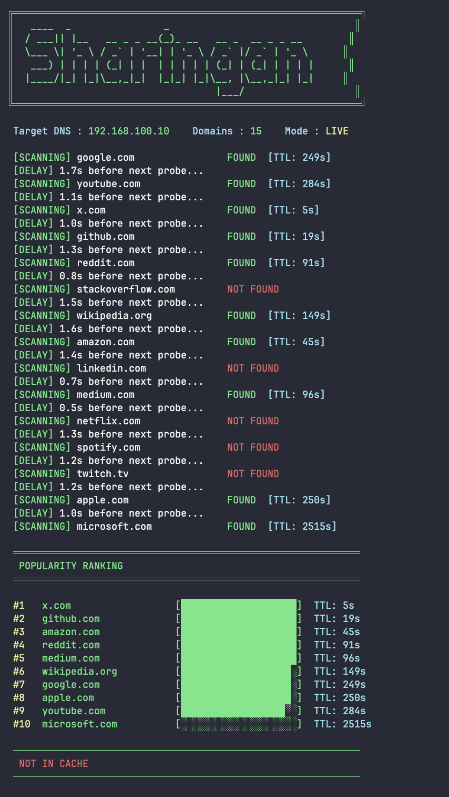

# Sharingan

A CLI tool that peeks into your local DNS resolver's cache to find out which websites are popular in your area. It checks a list of well-known domains against the local DNS cache and ranks them by how long they've been sitting there — the longer a record has been cached, the higher it ranks.

## How It Works

When someone on your network visits a website, the DNS resolver caches the lookup. Sharingan sends non-recursive queries (meaning it only checks what's already cached, without triggering new lookups) to your local DNS resolver for a list of domains. If a domain is found in the cache, it shows up in the results along with its remaining TTL. Lower remaining TTL means the record has been in cache longer, which implies it was visited earlier and is likely accessed frequently enough to stay cached.

Results are displayed with a popularity ranking, color-coded output, and visual bars in the terminal.

## Preview



## Requirements

* macOS (uses `scutil --dns` to discover the local DNS resolver)
* Python 3

## Setup

```bash
conda create -n sharingan python=3.11 -y
conda activate sharingan
pip install -r requirements.txt

```

## Usage

```bash
# Check all domains against the real local DNS resolver
python main.py

# Test mode — uses Google's public DNS (8.8.8.8) instead of local
python main.py --test

# Only check the first 5 domains from the list
python main.py --nums 5

# Combine both
python main.py --test --nums 3

```

## AI Disclaimer

This tool was built using [Automatic Programming](https://antirez.com/news/159), a term coined by [antirez](https://github.com/antirez) to describe a high-quality software production process guided by human intuition, design, and continuous steering. This project was shaped by strict architectural decisions and technical oversight:

* I provided the initial requirements and constraints for the project.
* I asked the AI to produce a plan before writing any code. I reviewed the plan and gave the go-ahead only after I was satisfied with the approach.
* During implementation, I steered design decisions constantly. I caught redundant logic, removed unnecessary wrapper functions, identified that the tool was accidentally triggering DNS resolution instead of only reading the cache, and rejected an authoritative server lookup that went against the project's intent.
* I directed the restructuring to reduce file clutter and shaped the output style.
* No code was written by hand, only prompts and review.

As [antirez](https://github.com/antirez) notes, "Programming is now automatic, vision is not." This software is a product of that vision.