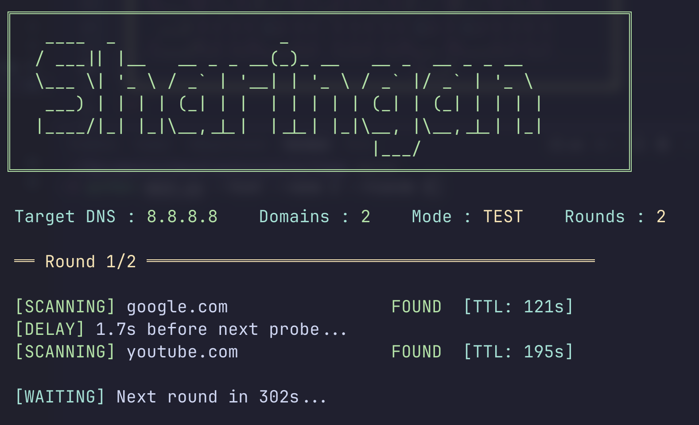
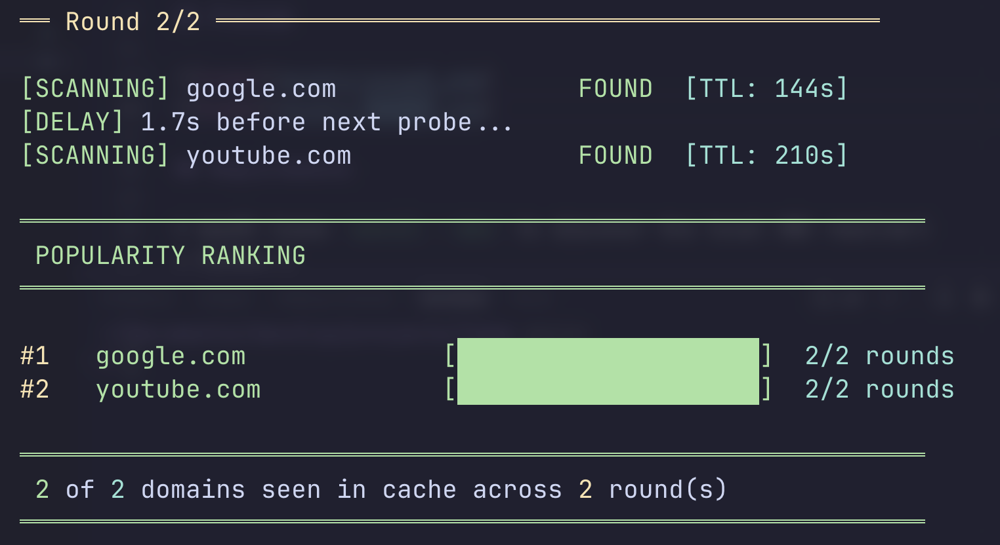

# Sharingan

A CLI tool that peeks into your local DNS resolver's cache to find out which websites are popular in your area.

> Note: This project is for educational purposes only. It is designed to demonstrate DNS caching mechanisms.
## How It Works

When someone on your network visits a website, the DNS resolver caches the lookup. Sharingan takes multiple snapshots of the cache over time (separated by 300s, matching common DNS TTL expiry). A domain that keeps reappearing across snapshots is genuinely popular -- local users keep visiting it, causing it to be re-cached after each TTL expiry.

Domains are ranked by how many snapshots they appeared in. The one seen most frequently across rounds is the most popular. Domains never found in any snapshot are listed separately.

All queries are non-recursive (RD=0), meaning the tool only reads what's already cached without triggering new lookups.

## Preview

<div align="center">
  
  <p>Scanning phase with live countdown timer</p>
  <br>
  
  <p>Frequency-based popularity ranking after all rounds</p>
</div>

## Requirements

* macOS (uses `scutil --dns` to discover the local DNS resolver)
* Python 3

## Setup

```bash
git clone git@github.com:abdullahejazjanjua/sharingan.git
cd sharingan
conda create -n sharingan python=3.11 -y
conda activate sharingan
pip install -r requirements.txt
```

## Usage

```bash
# Check all domains, 3 rounds (default)
python main.py

# Single snapshot (no waiting between rounds)
python main.py --rounds 1

# Test mode — uses Google's public DNS (8.8.8.8) instead of local
python main.py --test

# Only check the first 5 domains from the list
python main.py --nums 5

# 5 rounds, test mode, first 3 domains
python main.py --rounds 5 --test --nums 3

```

## AI Disclaimer

This project was born out of a desire to build this tool while lacking the necessary time to write every line of code manually. I decided to use this as an experiment to see how AI has fundamentally changed the coding process.

* I provided the initial requirements and constraints for the project.
* I asked the AI to produce a plan before writing any code. I reviewed the plan and gave the go-ahead only after I was satisfied with the approach.
* During implementation, I steered design decisions constantly. I caught redundant logic, removed unnecessary wrapper functions, identified that the tool was accidentally triggering DNS resolution instead of only reading the cache, and rejected an authoritative server lookup that went against the project's intent.
* I directed the restructuring to reduce file clutter and shaped the output style.
* No code was written by hand, only prompts and review.

The result is a functional tool where the programming was automated, but the technical vision and quality control remained entirely mine.